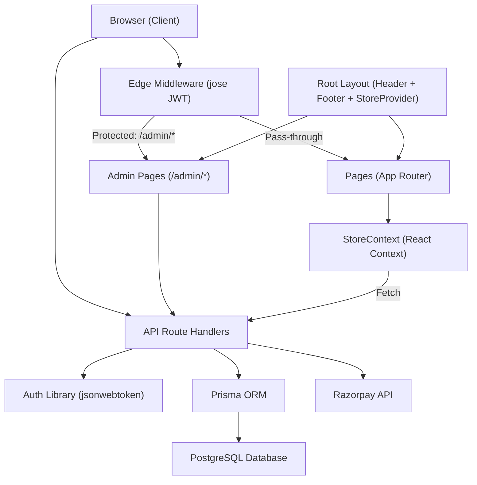
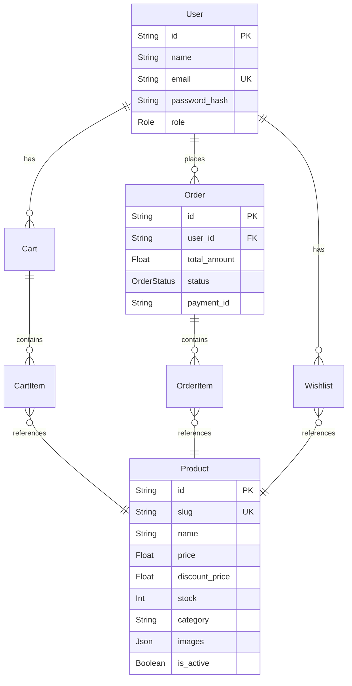

# Architecture

## System Diagram



## Component Overview

### Frontend (Storefront)
- **Purpose**: Customer-facing UI — browsing products, cart, checkout, orders
- **Key Files**: `src/app/page.tsx`, `src/app/products/`, `src/app/cart/`, `src/app/checkout/`, `src/app/orders/`
- **Depends On**: StoreContext, API routes
- **Depended By**: None (top-level)

### Admin Panel
- **Purpose**: Dashboard for managing products, orders, and users
- **Key Files**: `src/app/admin/layout.tsx`, `src/app/admin/page.tsx`, `src/app/admin/products/`, `src/app/admin/orders/`, `src/app/admin/users/`
- **Depends On**: API routes (admin + products + orders)
- **Depended By**: None (top-level)

### API Layer
- **Purpose**: RESTful API endpoints handling auth, products, cart, orders, and payments
- **Key Files**: `src/app/api/auth/`, `src/app/api/products/`, `src/app/api/cart/`, `src/app/api/orders/`, `src/app/api/payment/`, `src/app/api/admin/`
- **Depends On**: Prisma, Auth library, Razorpay SDK
- **Depended By**: Frontend pages, Admin panel, StoreContext

### State Management (StoreContext)
- **Purpose**: Global client-side state for cart, wishlist, user auth status
- **Key Files**: `src/context/StoreContext.tsx`
- **Depends On**: API routes (`/api/auth/me`, `/api/cart/*`)
- **Depended By**: Header, all pages that need cart/user data

### Authentication
- **Purpose**: JWT-based auth with dual implementation (Edge + Node)
- **Key Files**: `src/lib/auth.ts` (Node), `src/middleware.ts` (Edge)
- **Depends On**: `jsonwebtoken`, `jose`, `bcryptjs`
- **Depended By**: API routes, Middleware

### Database (Prisma)
- **Purpose**: ORM layer and singleton client
- **Key Files**: `prisma/schema.prisma`, `src/lib/prisma.ts`, `prisma/seed.js`
- **Depends On**: PostgreSQL
- **Depended By**: All API routes

### Styling
- **Purpose**: Premium dark-mode UI with BEM-named vanilla CSS
- **Key Files**: `src/styles/globals.css` (design tokens + base), `src/styles/*.css` (per-section)
- **Depends On**: Google Fonts (Inter, Playfair Display)
- **Depended By**: All pages and components

## Data Flows

### 1. Product Browsing
```
Browser → GET /api/products?category=X → Prisma findMany → PostgreSQL → JSON response → React renders product cards
```

### 2. Add to Cart (Logged-in User)
```
User clicks "Add to Cart" → StoreContext optimistic update (local state) → POST /api/cart/add → Verify JWT → Prisma upsert CartItem → DB → Re-fetch cart from DB to sync state
```

### 3. Checkout & Payment
```
User fills shipping → POST /api/payment/create-order → Razorpay.orders.create() → Returns order_id → Frontend opens Razorpay Checkout → User pays → POST /api/payment/verify → Verify signature → Create Order + OrderItems in DB → Deduct stock → Clear cart → Redirect to /orders
```

### 4. Admin Product CRUD
```
Admin navigates to /admin/products → GET /api/products → Lists products → Admin clicks Add/Edit → POST/PUT /api/products → Verify ADMIN role from JWT → Prisma create/update → DB
```

## Key Functions & Entry Points

| Function/Class | File | Purpose |
|---|---|---|
| `StoreProvider` | `src/context/StoreContext.tsx` | Global state provider (cart, wishlist, auth) |
| `useStore()` | `src/context/StoreContext.tsx` | Hook to access global state |
| `signToken()` / `verifyToken()` | `src/lib/auth.ts` | JWT operations for API routes |
| `middleware()` | `src/middleware.ts` | Edge middleware protecting `/admin/*` |
| `prisma` (singleton) | `src/lib/prisma.ts` | Prisma client instance |
| `GET /api/products` | `src/app/api/products/route.ts` | List active products with optional category filter |
| `POST /api/products` | `src/app/api/products/route.ts` | Admin: create new product |
| `POST /api/cart/add` | `src/app/api/cart/add/route.ts` | Add item to cart (stock check) |
| `POST /api/payment/create-order` | `src/app/api/payment/create-order/route.ts` | Create Razorpay order |
| `POST /api/payment/verify` | `src/app/api/payment/verify/route.ts` | Verify payment, create order, deduct stock |

## Database Schema Summary

The schema (`prisma/schema.prisma`) defines 7 models:



**Key relationships:**
- `User` → many `Cart`s → many `CartItem`s → `Product`
- `User` → many `Order`s → many `OrderItem`s → `Product`
- `User` → many `Wishlist` entries → `Product`

**Enums:**
- `Role`: `USER` | `ADMIN`
- `OrderStatus`: `PENDING` | `PAID` | `FAILED` | `SHIPPED`
